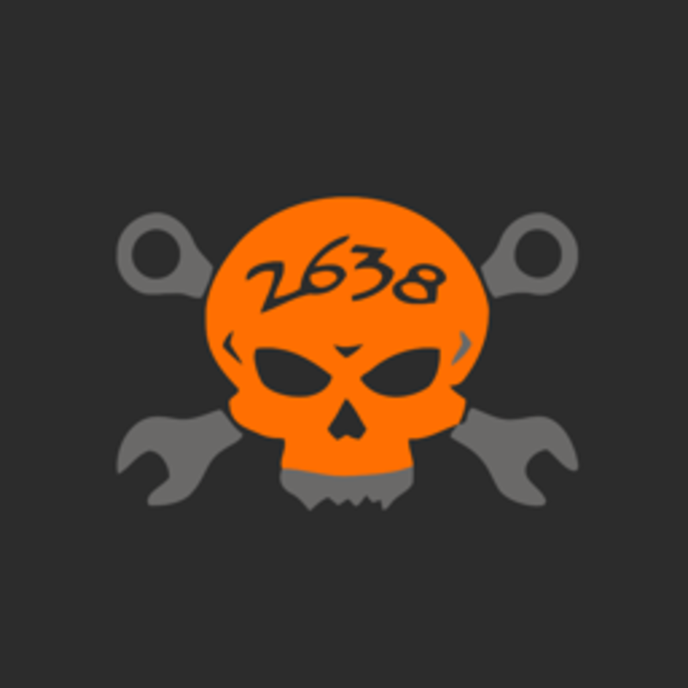

<div align="center">
    <h1> Agath</h1>
    <p>A scouting app designed for the FRC 2026 game, Rebuilt.</p>
</div>

## Introduction

Agath is a mobile FRC scouting application built with React Native and Expo. It allows scouts to record robot data during autonomous, teleop, and endgame phases, then sync that data to a backend server or transfer it offline via QR codes. The app is built for [FRC Team 2638](https://github.com/rebels2638) but is open-source and any team may fork and adjust the code accordingly.

## Screenshots

*Coming soon.*

## Prerequisites

- [Node.js](https://nodejs.org/) v24+
- [Expo CLI](https://docs.expo.dev/get-started/installation/) (`npx expo`)
- An Android/iOS device or emulator

## Installation

1. Clone the repository:
   ```bash
   git clone https://github.com/rebels2638/ScoutingApp2026.git
   cd ScoutingApp2026
   ```

2. Install dependencies:
   ```bash
   npm install
   ```

3. **(Optional)** Configure the Appwrite backend:
   ```bash
   cp .env.example .env
   ```
   Then fill in `.env` with your Appwrite project credentials. Note that you will also need to set up the Appwrite database and scripts. The app runs fully offline without this step and is how it was intended to be used by other teams.

## Running the App

Start the Expo development server:
```bash
npx expo start
```

Then press the corresponding key to launch on a specific platform.

Or run directly:
```bash
npm run android
npm run ios
npm run web
```

## Team

<a href="https://github.com/EthanDevCode">
  
</a>

<h3><a href="https://github.com/EthanDevCode">Ethan Kang</a></h3>
<strong><em>Lead Developer</em></strong>

Have a suggestion or a bug report? Head over to the `Issues` tab to let me know!  

<br clear="left"/>
<br/>

## License

This project is licensed under the [GNU General Public License v3.0](LICENSE).
